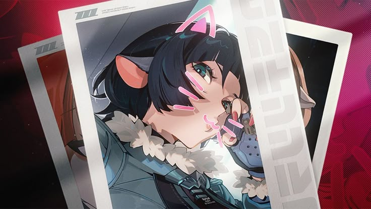

<!-- Banner -->

  

# Hi there 👋 I'm Cheesy

> ♯┆ cheesy or nay   𓏽   they / them  ⁔⏜  
> 𝄚𝅦𝄚  oo 's huzz  𝄞  ilmbf  d=(^o^)=b 3 years ago , the world began

💻 I'm a student currently learning CSS & Java  

## 🛠 Languages & Tools

  
  
  
  
  
  

## 📊 GitHub Stats

  

  

Thanks for visiting my profile! 

